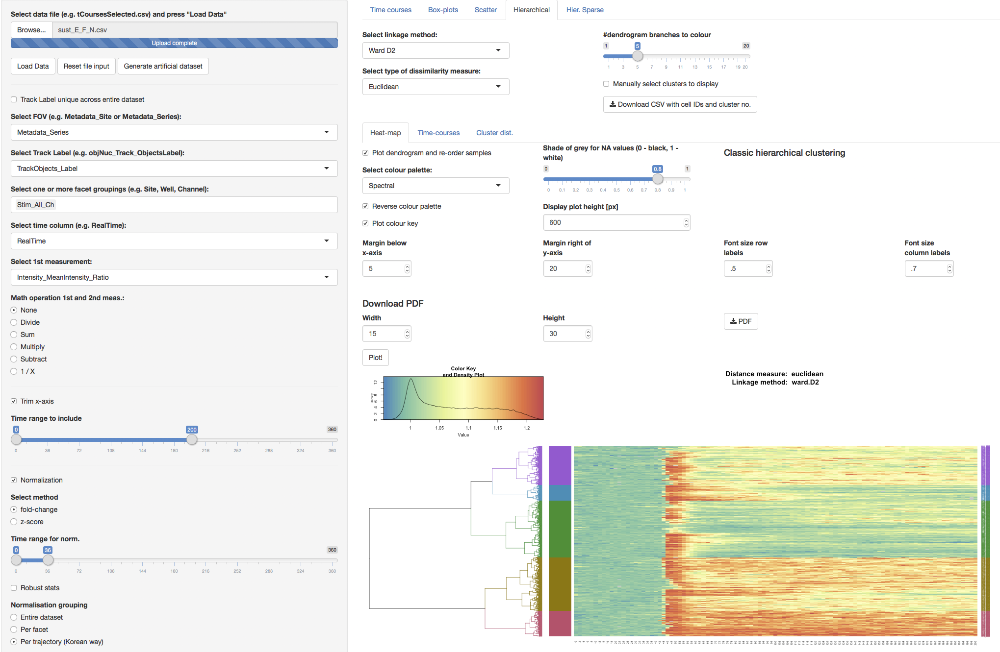

# TCI - Time-course analysis web-app

  * [What is TCI?](#what-is-tci)
  * [How to cite us?](#how-to-cite-us)
  * [Getting started](#getting-started)
    + [Running the app locally](#running-the-app-locally)
    + [Running the app directly from GitHub](#running-the-app-directly-from-github)
    + [Runnning instance](#running-instance)
    + [Running the app on a server](#running-the-app-on-a-server)
  * [Input file](#input-file)
      - [Long format](#long-format)
      - [Wide format](#wide-format)
  * [Unique track IDs](#unique-track-ids)
  * [Further plot customization with ggplot and ggedit](#further-plot-customization-with-ggplot-and-ggedit)
  * [Modules and Functionality](#modules-and-functionality)
  * [Clustering](#clustering)
    + [Cluster validation](#cluster-validation)

## What is TCI?
Time Course Inspector (TCI) is a software for visualization, analysis and clustering of time-series. The driving philosophy is to provide a simple, yet flexible GUI to perform various time-series analyses without any programming knowledge. TCI is written as an R shiny web app which provides a reactive, fast and customizable framework to produce elegant visualizations. 

The **screencast** with an overview of the app's functionality and processing of the [test-case-1](https://github.com/dmattek/shiny-timecourse-inspector/tree/master/example-data/test-case-1 "Link to data") dataset can be found [here](https://youtu.be/pwRqUzf5HMs "Link to YouTube").

If you just wish to give the app a quick try without installing it, you can access a **running instance** at [shinyapps.io](https://macdobry.shinyapps.io/tcourse-inspector/ "Link to a running app"). Bear in mind that your experience using this instance might be sluggish and that the number of uses per month is limited. For a quick trial, we rather recommend to run the app directly from GitHub as described in sections below.



The starting point of the app is a plain spreadsheet in comma-separated values format (CSV) that contains the dataset to analyze. TCI embeds a module for simple preprocessing of the data (normalization, missing values handling...), various visualizations, common statistics report, spectral decomposition, a flexible module for hierarchical clustering and cluster validation. All modules are documented with tooltips and *Learn More* sections to guide users through the UI and assist them with the analysis.

TCI puts the accent on spotting the unique dynamics that underly the time-series in the datasets. Its full potential is revealed when working with groups of time-series from which one wishes to understand their respective specificity and differences. To this effect, the clustering module works on pooled data, meaning that all groups of series will be considered at once when running the clustering procedure. The resulting clusters can then be inspected to visualize which types of series, patterns and frequencies were captured by each cluster. In addition, the distribution of clusters acroos the groups can be visualized to understand which dynamics or trends were over/under-represented in each group.

The project is open-source and free to use under GPL3 license. Feedbacks and contributions from the users are greatly encouraged!

## How to cite us?

If you use TCI for your work, please cite the following paper:
```
Dobrzyński, M., Jacques, M. A., & Pertz, O. (2019). Mining single-cell time-series datasets with Time Course Inspector. Bioinformatics.
```

## Getting started

The app can be run either locally or on a server. The installation process is detailed below.

### Running the app locally

#### Prerequisites
TCI works on all major OS (Windows, macOS, standard Linux distributions) and only requires a recent R installation on which the standard package `shiny` is installed. Instructions to install R can be found on the official [R-project website](https://www.r-project.org/). Once R is installed, one can install the `shiny` package by typing: `install.packages("shiny")` in the R console.

The app depends on many more packages which should be automatically installed when the user launches the app for the first time. The complete list of dependencies can also be manually installed from the R console by typing:
```
install.packages(c("shiny", "shinyjs", "shinyBS", "shinycssloaders",
					"R.utils", "data.table", "DT",
					"ggplot2", "gplots", "plotly", "scales", "grid",
					"dendextend", "RColorBrewer", "ggthemes",
					"sparcl", "dtw", "factoextra",
					"imputeTS", "MASS", "robust", "pracma", "Hmisc")) 
```

For new R users, once you have installed R, we recommend to use R from Rstudio. It provides an excellent programming interface and makes it slightly easier to run TCI in a click! Instructions for installation can be found on the [Rstudio website](https://rstudio.com/).

#### Install and Start the App
First, download the latest version of the app directly from the [GitHub repository](https://github.com/dmattek/shiny-timecourse-inspector)(green button *Clone or download*, download as zip). Unzip the folder and place it in your favorite location. 

If you have installed RStudio, launch it and go to *File -> Open Project*. In the contextual menu navigate to the location where you placed the app and open the file `tcourse-inspector.Rproj`. This will load the app in the current Rstudio session, what makes it very easy to use. To start the app, open the `server.R` or the `ui.R` file in the Rstudio session, then click the *Run App* button with a green triangle in the upper right corner of the window with code open.

If you did not install Rstudio, or do not wish to use it, you can also start TCI directly from your OS's command line with:
```
R -e "shiny::runApp('path-to-application-folder')"
```
In this case, open your web browser and point to the address given by the output of that command.

### Running the app directly from GitHub
If you have already an R installation with `shiny` installed you can also run the two following lines in your R console to get immediatly started with a temporary copy of the app:
```
library(shiny)
runGitHub("dmattek/shiny-timecourse-inspector")
```
If you like it, we strongly recommend that you switch to a regular installation! This will make it work offline without the need to download the source code at every start.

### Running instance
Access the running instance of the app at [shinyapps.io](https://macdobry.shinyapps.io/tcourse-inspector/ "Link to a running app").

### Running the app on a server
The app can be deployed on RStudio/Shiny server. Please follow the instructions [here](https://shiny.rstudio.com/deploy/ "Shiny - Hosting").

## Input file

The app recognizes CSV (comma-separated values) files where data columns are separated by a comma and floating point numbers use a dot (full-stop). Compressed CSV files in zip or bz2 format can be uploaded directly without decompression. Both long and wide data formats are accepted but we highly recommend using the long format because it allows for multiple groupings and multivariate measurements.

#### Long format
In the long format, the first row should include column headers. The input CSV file should contain at least these three columns:

* Identifier of a time series, i.e. a track label
* Time points
* Time-varying variable

| ID | Time | Meas1 |
|----|------|-------|
| 1  |  1   | 3.3   |
| 1  |  2   | 2.1   |
| 1  |  4   | 4.3   |
|----|------|-------|
| 2  |  1   | 2.8   |
| 2  |  2   | 1.9   |
| 2  |  3   | 1.7   |
| 2  |  4   | 2.2   |

In case of multivariate time series, additional columns with variables can be added in the input. Then, the GUI allows for choosing a single or a combination of two variables to display.

Time series can be grouped by introducing a grouping column:

| Group | ID | Time | Meas1 |
|-------|----|------|-------|
| gr1   | 1  |  1   | 3.3   |
| gr1   | 1  |  2   | 2.1   |
| gr1   | 1  |  4   | 4.3   |
|-------|----|------|-------|
| gr1   | 2  |  1   | 2.8   |
| gr1   | 2  |  2   | 1.9   |
| gr1   | 2  |  3   | 1.7   |
| gr1   | 2  |  4   | 2.2   |
|-------|----|------|-------|
| gr2   | 1  |  1   | 5.1   |
| gr2   | 1  |  2   | 5.4   |
| gr2   | 1  |  3   | 5.3   |

Introduction of grouping allows for the analysis and displaying data per group.

#### Wide format
In wide format, entire univariate time series are stored as rows, with columns treated as time points. The first two columns should contain a grouping and the identifier of time series.

| Group | ID | 0   | 1   | 2   | further time points |
|-------|----|-----|-----|-----|---------------------|
| gr1   | 1  | 3.0 | 3.3 | 3.1 | ...                 |
| gr1   | 2  | 2.0 | 2.1 | 1.9 | ...                 |
| gr2   | 1  | 4.9 | 5.1 | 5.0 | ...                 |
| gr2   | 2  | 5.2 | 5.4 | 5.3 | ...                 |
| gr2   | 3  | 5.5 | 5.3 | 5.6 | ...                 |

We do not recommend this format because of its lack of flexibility. In wide format, only one grouping column and one measurement can be passed at a time, this means any new grouping or measurement analysis requires to create a dedicated file.

## Unique track IDs

For the analysis, track labels need to be unique across the entire dataset. If the track label column is not unique in the uploaded dataset, there's an option in the UI to create a unique track ID. Check the *Create unique track label* box on and choose grouping columns that will be added to the existing non-unique track label. 

In the example above, the `ID` column is not unique across the dataset (ID=1 is repeated in group `gr1` and `gr2`), therefore the unique track label has to consist of columns `Group` and `ID`. The resulting track label will be `gr1_1`, `gr2_1`, etc.

## Further plot customization with ggplot and ggedit

TCI offers quite some flexibility with the appearance of plots, most of which are built with the popular library `ggplot2`. However, as we wish to keep the UI light and focused, you might end up not being able to perfectly customize some little details. Should this happen, most plot objects can be downloaded for further processing by means of the *Download RDS* buttons. The resulting files contain an R object which can be loaded in an R session with `plotObject <- readRDS('path/to/file')`.

From there, two options are available to customize the plot. Either you feel comfortable with `ggplot` and you can modify the plot directly. Otherwise, we propose to use `ggedit`, an R package that provides a GUI to modify the plots without any programming required. Instructions to install and run `ggedit` can be found on the [ggedit GitHub repository](https://github.com/metrumresearchgroup/ggedit). 

A minimal example of plot modification with ggedit in an R session would look like:
```
library(ggedit)
library(ggplot2)

plotObject <- readRDS('path/to/file')
plotObjectModified <- ggedit(plotObject)
```


## Modules and Functionality

The app opens with a default window that allows to plot population averages, individual time series, and power spectral density. 

The following features of time series analysis are available in the app:

- Perform simple **math calculations** on an individual variable (inversion 1/X), or on two variables (division, sum, multiplication, subtraction).
- **Trim** the time axis of the data.
- **Normalise** to the average of data points in a selected interval. Time series can be normalised with respect to the entire dataset, a group, or a single time series. The latter would normalise every time course to the mean of its own selected interval.
- **Remove outlier time points** by removing a percentage of data from the top, bottom, or both tails of pooled data points. Gaps in time series due to outlier removal can be then linearly interpolated or tracks can be removed entirely from the set. The UI allows for selecting the size of gaps above which the track is removed.
- **Highlight** individual time series by selecting a unique series identifier.
- Calculate area under individual time series and visualise as a dot-, violin-, or a box-plot. The UI allows for selection of the time series range used for **AUC** calculation.
- Display a dot-, violin-, box-, or a line-plot for selected time points.
- Display a scatter-plot to identify **correlations** between two time points.
- Calculate the **power spectral density (PSD)** using smoothed periodogram or autoregressive fit. Both estimations rely on the R's built-in implementation `spectrum`. PSD plots can be visualized in the frequency or period domain and independently for each time-series groups. Axis can be transformed with common functions (log, inverse...) to facilitate the identification of spectral patterns.
- Perform **hierarchical and sparse-hierarchical clustering** of individual time series. In these modules, the dendrogram can be cut at a chosen level to help visualising clusters. Addiitonally available are plots with cluster averages, individual times series per cluster, and contribution of time series from different groupings to clusters.
- Perform **cluster validation**. In this module both relative and internal validations are available. Relative validation with a sweep through a range of possible cluster numbers and a report of average silhouette width and within cluster sum of squares. Internal cluster validation, for a fixed number of clusters return 3 visualizations: a dendrogram colored according to the cut, the silhouette plot and a visualization of the clusters on the first 2 principal components. This analysis relies on the implementation in the R package `factoextra`.

## Clustering

TCI performs [hierarchical clustering](https://en.wikipedia.org/wiki/Hierarchical_clustering "Link to wiki") on data pooled from all groups (experimental conditions). The results of clustering are displayed as heatmaps with time series arranged in rows and time points shown in columns. The arrangement of clusters in the heatmap is illustrated by the dendrogram. The UI allows to *cut* the dendrogram at a desired level and to highlight major tree branches. This is useful to plot cluster averages and time series within such clusters in other tabs of that module. If grouping is present in the dataset, it is possible to plot the fraction of time series from different clusters per group as a stacked bar plot.

TCI uses a number of distance metrics and linkage methods available in R. For high dimensional data such as time series, it is typically better to use [Manhattan distance](https://en.wikipedia.org/wiki/Taxicab_geometry "Link to wiki"). It is less likely to be influenced by outliers compared to Euclidean or other higher dimensional norms (read more [here](https://bib.dbvis.de/uploadedFiles/155.pdf "Link to a publication") and [here](https://datascience.stackexchange.com/questions/20075/when-would-one-use-manhattan-distance-as-opposite-to-euclidean-distance "Link to stackexchange")).

[Dynamic time warping](https://en.wikipedia.org/wiki/Dynamic_time_warping "Link to wiki") is particularly useful metric to compute similarities between time series that have features relevant for clustering but shifted in time. Conventional metrics such as Euclidean distance calculate the distance independently for every time point. Thus two time series with an identical transient peak that takes place at different points in time may result in a very large distance. DTW tries to match such shapes and align them together. 

[Sparse hierarchical](https://cran.r-project.org/web/packages/sparcl/index.html "Link to CRAN") clustering is available in a separate tab and is suitable for datasets when the number of time points is much larger than the number of time-series, i.e. a \emph{sparse} dataset. In such cases, true clusters differ only with respect to a small fraction of time points. Such clusters may not be distinguished properly if all time points are taken into consideration, especially those that have similar measurement values across the time series. To avoid that, sparse clustering assigns weights to time points and discards those that do not contribute to clustering and thus have low weights. In TCI, we have labelled time points according to their weights, which is visualised in column names of the heatmap plot.

The complete linkage method adds objects to already existing clusters by looking at the farthest object in that cluster. This adds robustness to clusters and avoids formation of clusters that consist of “accidental” elements. 

### Cluster validation

[Hierarchical clustering](https://en.wikipedia.org/wiki/Hierarchical_clustering "Link to wiki") produces a dendrogram with a hierarchy of distances between individual time series. A common procedure is to cut the dendrogram at a manually chosen level to highlight main branches that correspond to main clusters in the dataset. Though the process of finding the right cut is empirical and should be done in an interactive, iterative fashion, some metrics can provide computational support for a given clustering. TCI integrates two types of cluster validation implementation in the R package [factoextra](https://cran.r-project.org/web/packages/factoextra/index.html): relative and internal. The former sweeps through a range of possible cluster numbers and reports global metrics about the goodness of clustering. The current implementation returns two such metrics: the average silhouette width and the within cluster sum of squares (WSS). 

The [silhouette analysis](https://en.wikipedia.org/wiki/Silhouette_(clustering) "Link to wiki") computes how close each trajectory is to other time series in the cluster it is assigned to. This is then compared to closeness with trajectories in other clusters. Larger average silhouette widths usually indicate better clustering. To make sure averaging does not hide a locally bad clustering, this should be inspected along with the silhouette plot for a particular number of clusters using internal validation available in another tab.

[WSS](https://en.wikipedia.org/wiki/K-means_clustering#Description "Link to wiki"), or variance, evaluates the compactness of clusters. Compact clusters achieve low WSS values. When plotted as function of the number of clusters, WSS would typically display decrease and level off. This inflection point, i.e. *the elbow*, beyond which further increase in the number of clusters does not confer a significant decrease in WSS is considered an optimum.

With internal cluster validation, the user provides a number of clusters and can inspect the quality of this partitioning. TCI offers three visualisations: a dendrogram coloured according to the cut level, the silhouette plot, and a visualisation of the clusters using first two principal components.
